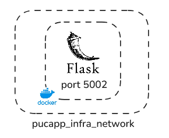
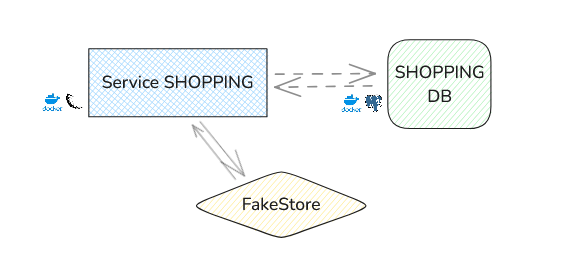
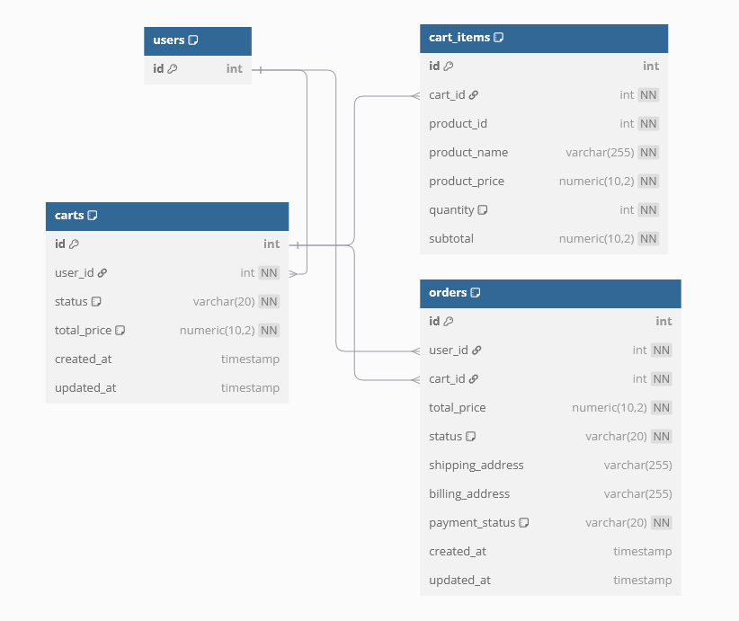
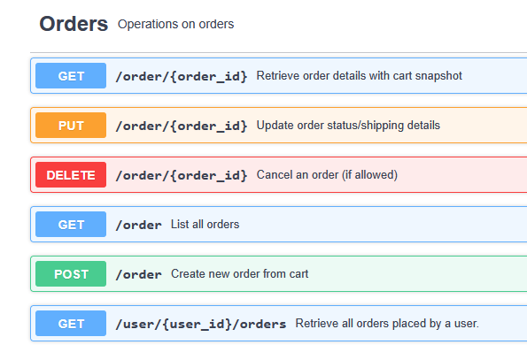
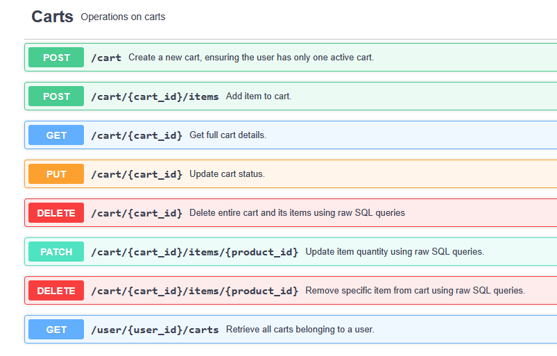
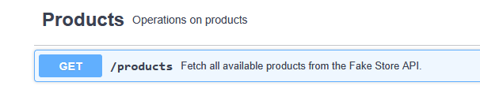

# PUCAPP SERVICE SHOPPING
Gilmar Neves

> .  
> 🧩 **Part of a Multi-Service Project**
>
> This service is one piece of a larger microservices-based project. You can find the related repositories below:
>
> - [**Infrastructure Service**](https://github.com/nevesgil/pucapp_infra)
> - [**Users Service**](https://github.com/nevesgil/pucapp_service_users)
> - [**Shopping Service**](https://github.com/nevesgil/pucapp_service_shopping)
> - [**Principal Gateway**](https://github.com/nevesgil/pucapp_principal_gateway
>.

## Summary

- [Introduction](#introduction)
- [Tech and Tools](#tech-and-tools)
- [Architecture](#architecture)
     - [Database Model](#database-model)
- [Use](#use)
    - [Endpoints](#endpoints)

### Introduction

PucappService is a MVP for evaluating the capabilities of Microservices in an app that serves the purpose of being a shopping service coupled with an users registering service.

The SHOPPING SERVICE provides a Flask API (Python) for users to interact with products, carts and orders either via registering, updating, retrieving and deleting those using HTTP methods in a REST API.

The API is exposed in port 5002.

The data is stored in PostgreSQL databases.
In order to connect the API with the database servives, we need them to run in the same network.

The Carts part of the service uses an external API FakeStore (https://fakestoreapi.com/) for retrieving products and their attributes such as prices, description, and details.


### Tech and Tools
  


This API runs in the network created in the infrastructure service.
The service is built in Flask using other Python libraries such as Marshmallow for creating and validating schemas and SQLAlchemy for ORM.

It also consumes data from the external API FakeStore.


The storage runs in another service and is accessed on port 5432 (PostgreSQL).

### Architecture

The containers we have run on the same docker network and, thus, can communicate to each other in a easily manner.
The FakeStore API is external and hosted as a public service.



```
> ORDERS

GET /order/{order_id}
PUT /order/{order_id}
DELETE /order/{order_id}
GET /order
POST /order
GET /user/{user_id}/orders

> CARTS

GET /cart/{cart_id}
PUT /cart/{cart_id}
DELETE /cart/{cart_id}
POST /cart
PATCH /cart/{cart_id}/items/{product_id}
DELETE /cart/{cart_id}/items/{product_id}
GET /user/{user_id}/carts

> PRODUCTS

GET /products


```

#### Database Model

In the database shopping_db, one may find the normalized model:



### Use

> .  
> ⚠️ **Attention**
>
> Before running any service containers, **ensure the infrastructure services (e.g., database, network) are up and running**.
> Failing to do so may result in connection errors or failed startup for dependent services.
> 
> 🔗 The infrastructure service can be found [**here**](https://github.com/nevesgil/pucapp_infra).  
> .

In order to use this for running the project, please follow the steps described below:

i) Clone the repository into your machine as:

```
git clone https://github.com/nevesgil/pucapp_service_users.git
```

ii) Run the docker compose file

Having the Docker up and running on your machine, you may simply run the command below to have the services running:

```
docker compose up -d --build
```

Obs:
When not using the service anymore, run:
```
docker compose down
```

iii) Access the service on https://localhost:5002


#### Endpoints

##### Orders



##### Carts



##### Products

